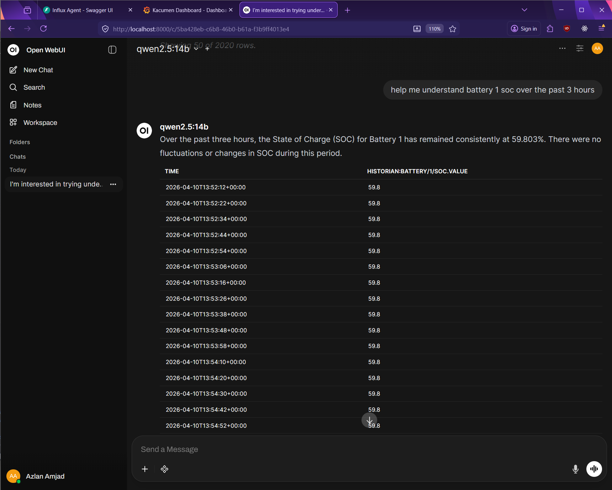
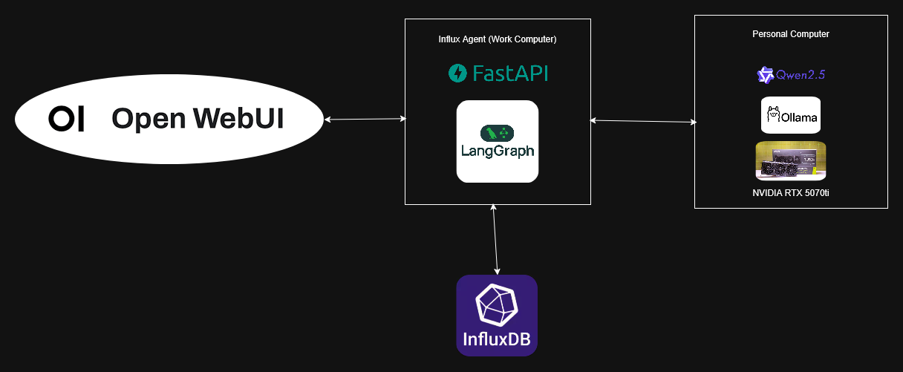
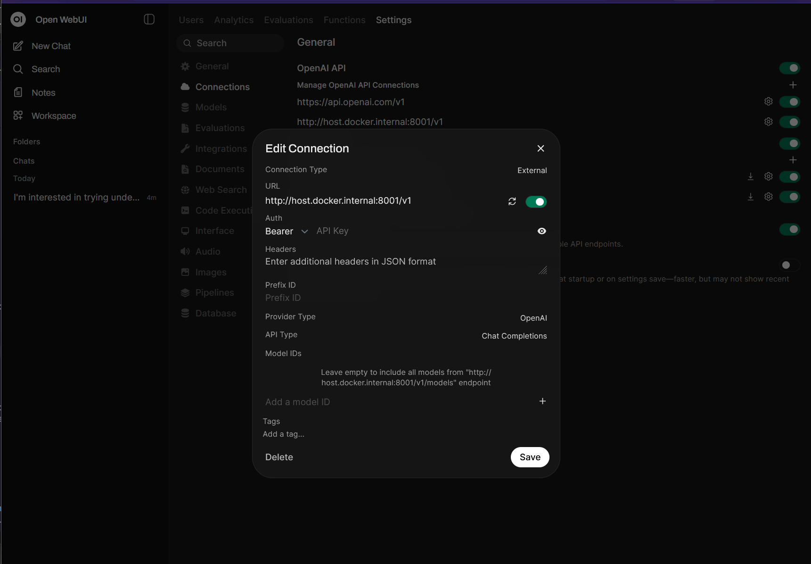

# Influx-Agent

> Natural-language query agent for InfluxDB time-series data, powered by LangGraph and Ollama.

Influx-Agent is a FastAPI service that accepts natural-language questions about your InfluxDB data and returns structured query results with AI-generated summaries. It exposes an **OpenAI-compatible API** so it can be used as a drop-in backend for [Open WebUI](https://github.com/open-webui/open-webui) or any OpenAI-compatible client.

<!-- TODO: screenshot of Open WebUI connected to Influx-Agent -->


---

## System Architecture

```
┌──────────────┐       ┌──────────────────────────┐       ┌───────────────────┐
│              │       │                          │       │                   │
│  Open WebUI  │─────▶│  Influx-Agent (FastAPI)  │──────▶│  Ollama Server    │
│  or any      │  HTTP │                          │  HTTP │  (remote/local)   │
│  OpenAI      │       │  LangGraph Agent         │       │  qwen2.5:14b      │
│  client      │       │                          │       │                   │
└──────────────┘       └────────────┬─────────────┘       └───────────────────┘
                                    │
                                    │ InfluxQL
                                    ▼
                            ┌───────────────┐
                            │  InfluxDB v1  │
                            │  (time-series │
                            │   database)   │
                            └───────────────┘
```

<!-- high-level block diagram image -->


- **FastAPI** serves the OpenAI-compatible HTTP endpoints.
- **LangGraph** orchestrates a multi-step agent graph that classifies intent, selects databases/measurements, builds InfluxQL, executes queries, and summarises results.
- **Ollama** (running on a remote or local machine) provides the LLM inference via `langchain-ollama`.
- **InfluxDB v1** stores the time-series data queried by the agent.

### OpenAI Compatibility

The API is designed to be **indistinguishable from an OpenAI-compatible LLM API**:

| Endpoint | Purpose |
|---|---|
| `POST /v1/chat/completions` | Chat completion (non-streaming & SSE streaming) |
| `GET /v1/models` | Model discovery for Open WebUI |

This means Open WebUI, `curl`, or any OpenAI SDK can connect directly — no plugins or adapters needed.

---

## Getting Started

### Prerequisites

- **Python 3.11+**
- **InfluxDB v1** instance with your time-series data
- **Ollama** installed and running with the `qwen2.5:14b` model

### 1. Install Ollama

Follow the official installation guide for your platform: [https://ollama.com/download](https://ollama.com/download)

**On Windows:**

1. Download and run the installer from the link above.
2. Pull the default model:
   ```powershell
   ollama pull qwen2.5:14b
   ```
3. The Ollama server starts automatically and listens on `http://localhost:11434`.
4. If you want to run the Ollama server so it's accessible via your LAN network run the following:
   ```powershell
   $env:OLLAMA_HOST="0.0.0.0:11434"
   ollama serve
   ```

> If running Ollama on a **separate machine** on your LAN, note its IP address — you'll configure it in the `.env` file below.

### 2. Install Influx-Agent

```bash
git clone https://github.com/AzlanAmjad/Influx-Agent.git
cd Influx-Agent
pip install -e ".[dev]"
```

### 3. Configure

Create a `.env` file in the project root:

```env
OLLAMA_HOST=http://192.168.1.157:11434   # IP of your Ollama server
DEFAULT_MODEL=qwen2.5:14b
INFLUXDB_HOST=localhost
INFLUXDB_PORT=8086
LOG_LEVEL=DEBUG
```

### 4. Run the API

```bash
python -m app.src.main
```

The server starts on `http://0.0.0.0:8001` with hot-reload enabled.

### 5. Connect Open WebUI

In Open WebUI settings, add a new OpenAI-compatible connection:

| Field | Value |
|---|---|
| API Base URL | `http://host.docker.internal:8001/v1` |
| API Key | `anything` (not enforced) |

The agent will appear as a model automatically via the `/v1/models` endpoint.

<!-- TODO: Open WebUI configuration screenshot -->


---

## LangGraph Agent

The core of Influx-Agent is a **deterministic LangGraph** that routes each user question through a series of specialised nodes. The graph compiles once at startup and is reused across all concurrent requests.

<!-- TODO: LangGraph visual diagram -->
<!--  -->

```
START → classify_intent → guardrails ─┬─→ unsupported_response → END
                                       │
                                       └─→ select_database → refine_schema → resolve_time
                                               → select_measurements → build_query → execute_query
                                                                                        │
                                               ┌──── retry (max 1) ◄────────────────────┤
                                               │                                        │
                                               └─→ select_measurements                  ├─→ query_pipeline → END
                                                                                        └─→ anomaly_pipeline → END
```

### Node Reference

Each node is a plain function `(AgentState) → dict` that reads from shared state and returns only the keys it modifies.

| Node | Type | Description |
|---|---|---|
| **`classify_intent`** | 🤖 LLM | Classifies the user's question into `query`, `anomaly`, or `unsupported` with a confidence score. Uses structured JSON output. |
| **`guardrails`** | ⚙️ Deterministic | Hard gate: rejects queries that aren't InfluxDB-relevant, have an unsupported task type, or fall below the confidence threshold (0.55). |
| **`select_database`** | 🤖 LLM | Picks the most relevant InfluxDB database from the schema. Always includes `historian` alongside the primary DB for cross-database coverage. |
| **`refine_schema`** | ⚙️ Deterministic | Runs `SHOW MEASUREMENTS`, `SHOW TAG KEYS`, and `SHOW FIELD KEYS` against InfluxDB for each selected database. Results are cached in-process. |
| **`resolve_time`** | 🤖 LLM | Extracts time boundaries from the user's question (e.g. "last 3 hours" → `now() - 3h`). **Never fails** — defaults to a 6-hour window. |
| **`select_measurements`** | 🤖 LLM | Picks the specific measurements to query. The refined schema is grouped by pattern with descriptions so the LLM can match intent to the right data. |
| **`build_query`** | ⚙️ Deterministic | Assembles `SELECT * FROM ...` InfluxQL statements grouped by database, annotated with `-- db:<name>` for the executor. |
| **`execute_query`** | ⚙️ Deterministic | Runs each InfluxQL statement via `DataFrameClient`, prefixes columns for disambiguation, and outer-joins results on the time index. Triggers a retry loop (max 1) if measurements return empty. |
| **`query_pipeline`** | 🤖 LLM | Summarises the query results in 2–4 sentences using downsampled data for context, then renders a full Markdown table for the UI. |
| **`anomaly_pipeline`** | ⚙️ Stub | Renders the queried data as a Markdown table with a notice that anomaly detection is under development. |
| **`unsupported_response`** | ⚙️ Deterministic | Terminal node for rejected queries. Returns a user-friendly explanation of why the request couldn't be served. |

> 🤖 = interacts with the LLM &nbsp;&nbsp; ⚙️ = deterministic / no LLM call

### Example: `classify_intent` Node (LLM)

```python
def classify_intent_node(state: AgentState) -> dict:
    llm = get_llm(state["model"])
    response = llm.invoke([SystemMessage(content=system), HumanMessage(content=user_content)])
    parsed = extract_json(response.content)
    clf = _normalize_classification(parsed)
    return {"error": None, **clf.model_dump()}
```

### Example: `guardrails` Node (Deterministic)

```python
def guardrails_node(state: AgentState) -> dict:
    if not state.get("is_influx_relevant"):
        return {"task_type": "unsupported", "error": "Query is not relevant..."}
    if confidence < _CONFIDENCE_THRESHOLD:
        return {"task_type": "unsupported", "error": "Confidence too low..."}
    return {}
```

---

## Features

### ✅ Complete

- **Intent Classification** — LLM-powered classification of user queries into `query`, `anomaly`, or `unsupported` with confidence scoring and deterministic guardrails.
- **Database & Measurement Selection** — Automatic selection of the right InfluxDB database and measurements using schema-aware LLM prompts with regex-based pattern grouping.
- **Time Range Extraction** — Natural-language time parsing (e.g. "last 3 hours") with safe fallback defaults.
- **InfluxQL Query Generation** — Deterministic assembly of `SELECT *` queries with proper quoting and time bounds.
- **Query Execution & Merging** — Multi-measurement execution via `DataFrameClient` with column prefixing, outer-join on time index, and automatic retry on empty results.
- **LLM Query Summarisation** — Natural-language summary of results using downsampled data for representative context, paired with full Markdown table output.
- **OpenAI-Compatible API** — `POST /v1/chat/completions` (streaming & non-streaming) and `GET /v1/models` for seamless Open WebUI integration.
- **Schema Caching** — Live InfluxDB schema queries cached in-process for zero-latency repeat requests.

### 🚧 In Progress

- **Anomaly Detection Pipeline** — The `anomaly_pipeline` node is currently a stub that renders queried data with a work-in-progress notice. The planned implementation would integrate an external anomaly-detection tool — either through LangGraph tool nodes or via LLM tool-use capabilities (e.g. Gemma 4 function calling). One approach considered is an **MCP (Model Context Protocol) server** that performs lightweight ML inference on the queried time-series data to surface anomalies, which the agent would then summarise for the user.

---

## Project Structure

```
app/src/
├── main.py                        # FastAPI app, router registration, uvicorn
├── core/config.py                 # pydantic-settings from .env
├── schemas/chat.py                # Request/response Pydantic models
├── services/agent_service.py      # AgentService: loads schema, compiles & invokes graph
├── api/routes/
│   ├── openai.py                  # /v1/chat/completions, /v1/models
│   └── schema.py                  # /api/schema (cache inspection)
├── agent/
│   ├── state.py                   # AgentState TypedDict
│   ├── llm.py                     # get_llm(), extract_json(), last_user_message()
│   ├── schema_loader.py           # @lru_cache schema from influx_schema.json
│   ├── formatting.py              # Markdown table rendering
│   ├── graphs/agent_graph.py      # Graph topology, routing, compilation
│   └── nodes/
│       ├── intent_classifier.py   # 🤖 classify_intent
│       ├── guardrails.py          # ⚙️ guardrails
│       ├── select_database.py     # 🤖 select_database
│       ├── refine_schema.py       # ⚙️ refine_schema (+ cache)
│       ├── resolve_time.py        # 🤖 resolve_time
│       ├── select_measurements.py # 🤖 select_measurements
│       ├── build_query.py         # ⚙️ build_query
│       ├── execute_query.py       # ⚙️ execute_query
│       ├── query_pipeline.py      # 🤖 query_pipeline
│       ├── anomaly_pipeline.py    # ⚙️ anomaly_pipeline (stub)
│       └── unsupported_response.py# ⚙️ unsupported_response
├── db/client.py                   # InfluxDB v1 client wrappers
└── data/influx_schema.json        # Static measurement schema with descriptions
```
